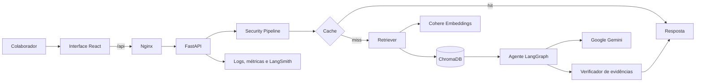

# Aurora Responde

> Assistente corporativo de inteligência artificial da **Café Aurora**, desenvolvido para responder dúvidas de colaboradores com base em documentos internos, de forma rastreável, segura e fundamentada.

[](https://www.python.org/)
[](https://fastapi.tiangolo.com/)
[](https://react.dev/)
[](https://docs.docker.com/compose/)
[](LICENSE)

## Sobre o projeto

O **Aurora Responde** é uma aplicação de Retrieval-Augmented Generation (RAG) criada para simular um agente interno de conhecimento da Café Aurora, uma rede fictícia de cafeterias.

O sistema consulta uma base documental corporativa para responder perguntas sobre temas como:

- operações das unidades;
- produtos, ingredientes e alergênicos;
- atendimento ao cliente;
- estoque e compras;
- recursos humanos;
- despesas e reembolsos;
- campanhas e procedimentos internos;
- unidades, horários e responsáveis.

As respostas são produzidas apenas quando existem evidências documentais suficientes. O agente também informa as fontes utilizadas, identifica possíveis conflitos entre documentos e evita responder perguntas fora do escopo da base de conhecimento.

> [!IMPORTANT]
> A Café Aurora, seus colaboradores, unidades, documentos e dados operacionais são inteiramente fictícios. O projeto foi criado para fins educacionais, demonstração técnica e experimentação com aplicações de IA generativa.

## Principais funcionalidades

- **RAG com busca semântica e lexical** sobre documentos internos.
- **Embeddings da Cohere** armazenados em uma base vetorial ChromaDB.
- **Geração de respostas com modelos Gemini** por meio do LangChain/LangGraph.
- **Verificação de evidências** antes de entregar a resposta ao usuário.
- **Citações das fontes** associadas às afirmações apresentadas.
- **Detecção de conflitos documentais** e recusa segura quando não há evidência suficiente.
- **Filtros de entrada e saída** para reduzir riscos de prompt injection e conteúdo indevido.
- **Rate limiting**, cache de respostas, métricas e logs estruturados.
- **Observabilidade opcional com LangSmith**.
- **Interface web responsiva** em React.
- **Deploy containerizado** com Docker Compose e Nginx.
- **Testes unitários, de integração e end-to-end**.

## Arquitetura



### Fluxo de uma pergunta

1. A interface envia a mensagem para `POST /chat`.
2. A API valida e sanitiza a entrada.
3. O cache é consultado.
4. A pergunta é transformada em embedding.
5. O retriever busca os trechos mais relevantes na base ChromaDB.
6. O agente gera uma resposta exclusivamente com base nas evidências recuperadas.
7. Um verificador confere se as afirmações estão ligadas às fontes corretas.
8. A API devolve a resposta, as fontes, o modelo utilizado e metadados de processamento.

Quando não há evidência suficiente, o agente responde que a informação não foi localizada, em vez de inventar uma resposta.

## Tecnologias

### Backend

- Python 3.13
- FastAPI
- Uvicorn
- LangGraph
- LangChain Google Generative AI
- Cohere Embeddings
- ChromaDB
- Pydantic Settings
- SlowAPI
- LangSmith
- Pytest
- Ruff
- uv

### Frontend

- React 19
- Vite
- Nginx

### Infraestrutura

- Docker
- Docker Compose
- Volumes persistentes para índice e dados de execução
- Deploy na nuvem da Oracle (OCI) utilizando o OCI Compute

## Estrutura do repositório

```text
.
├── apps/
│   ├── api/
│   │   ├── media/
│   │   │   └── cafeteria-documents/   # Base documental da Café Aurora
│   │   ├── src/
│   │   │   ├── partner_knowledge/     # Ingestão, indexação e recuperação
│   │   │   ├── agent.py               # Orquestração do agente
│   │   │   ├── main.py                # Aplicação FastAPI
│   │   │   ├── security.py            # Validações de segurança
│   │   │   ├── cache.py               # Cache de respostas
│   │   │   └── monitoring.py          # Logs e métricas
│   │   ├── tests/                      # Testes automatizados
│   │   ├── Dockerfile
│   │   ├── pyproject.toml
│   │   └── uv.lock
│   └── web/
│       ├── src/                        # Aplicação React
│       ├── Dockerfile
│       ├── nginx.conf
│       └── package.json
├── compose.yaml
├── compose.e2e.yaml
├── justfile
├── .env.example
└── LICENSE
```

## Pré-requisitos

### Execução recomendada com Docker

Instale apenas:

- Git;
- Docker Engine;
- Docker Compose v2.

As dependências de Python e Node.js são instaladas dentro das imagens.

### Desenvolvimento local sem Docker

- Python 3.13 ou superior;
- [uv](https://docs.astral.sh/uv/);
- Node.js compatível com Vite 7;
- npm;
- opcionalmente, [just](https://github.com/casey/just) para utilizar os atalhos do projeto.

Também são necessárias credenciais válidas para os provedores configurados.

## Configuração

Clone o repositório:

```bash
git clone https://github.com/flaviomurata/cafeteria-ai-chatbot.git
cd cafeteria-ai-chatbot
```

Crie o arquivo de ambiente:

```bash
cp .env.example .env
```

Preencha as credenciais no `.env`:

```dotenv
GOOGLE_API_KEY=your_google_api_key_here
COHERE_API_KEY=your_cohere_api_key_here

LANGCHAIN_TRACING_V2=true
LANGCHAIN_API_KEY=your_langchain_api_key_here
LANGCHAIN_PROJECT=cafeteria-ai-chatbot

APP_ENV=development
LOG_LEVEL=INFO
RATE_LIMIT=20/minute
CACHE_TTL_SECONDS=300
MAX_RETRIES=3

PARTNER_KNOWLEDGE_EMBEDDING_MODEL=embed-v4.0
PARTNER_KNOWLEDGE_QUERY_EMBEDDING_CACHE_SIZE=1024
PARTNER_KNOWLEDGE_RELEVANCE_THRESHOLD=0.45

E2E_MODE=live
```

### Variáveis principais

| Variável | Obrigatória | Descrição |
| --- | :---: | --- |
| `GOOGLE_API_KEY` | Sim | Credencial utilizada pelos modelos Gemini. |
| `COHERE_API_KEY` | Sim | Credencial utilizada para gerar embeddings. |
| `LANGCHAIN_TRACING_V2` | Não | Ativa ou desativa tracing com LangSmith. |
| `LANGCHAIN_API_KEY` | Condicional | Necessária quando o tracing está ativado. |
| `LANGCHAIN_PROJECT` | Não | Nome do projeto no LangSmith. |
| `APP_ENV` | Não | Ambiente da aplicação, como `development` ou `production`. |
| `LOG_LEVEL` | Não | Nível de logging da API. |
| `RATE_LIMIT` | Não | Limite de requisições por cliente. |
| `CACHE_TTL_SECONDS` | Não | Tempo de vida do cache de respostas. |
| `MAX_RETRIES` | Não | Número máximo de tentativas em chamadas aos provedores. |
| `PARTNER_KNOWLEDGE_EMBEDDING_MODEL` | Não | Modelo de embeddings da Cohere. |
| `PARTNER_KNOWLEDGE_EMBEDDING_DIMENSION` | Não | Dimensão dos vetores persistidos no índice. |
| `PARTNER_KNOWLEDGE_RELEVANCE_THRESHOLD` | Não | Pontuação mínima para considerar uma evidência relevante. |
| `E2E_MODE` | Não | Define o uso de provedores reais ou componentes locais de teste. |

> [!CAUTION]
> Nunca faça commit do arquivo `.env` nem exponha chaves de API em logs, imagens Docker ou código-fonte.

## Executando com Docker Compose

### 1. Construir o índice de conhecimento

Antes de iniciar a aplicação pela primeira vez, execute a ingestão dos documentos:

```bash
docker compose run --build --rm ingest-partner-knowledge
```

Com `just`:

```bash
just ingest
```

O processo lê os arquivos em `apps/api/media/cafeteria-documents`, cria os embeddings e persiste o índice em um volume Docker.

Sempre execute novamente a ingestão quando documentos forem adicionados, removidos ou alterados.

### 2. Iniciar a aplicação

```bash
docker compose up -d --build web
```

Com `just`:

```bash
just up
```

Acesse:

- Interface web: `http://localhost:3000`
- API: `http://localhost:8000`
- Swagger UI: `http://localhost:8000/docs`
- Health check: `http://localhost:8000/health`

Por padrão, as portas são publicadas apenas em `127.0.0.1`. Para acesso externo, utilize um reverse proxy com HTTPS ou altere os bindings de forma consciente.

### 3. Verificar os serviços

```bash
docker compose ps
```

Ou:

```bash
just ps
```

### 4. Visualizar logs

```bash
docker compose logs -f agent-api web
```

### 5. Encerrar os serviços

```bash
docker compose down
```

Para também remover os volumes persistentes:

```bash
docker compose down -v
```

> [!WARNING]
> A opção `-v` remove o índice construído. Uma nova ingestão será necessária antes da próxima execução.

## Desenvolvimento local

### Backend

```bash
cd apps/api
uv sync
uv run uvicorn src.main:app --reload
```

Ou, a partir da raiz:

```bash
just api
```

A API será iniciada em `http://localhost:8000`.

### Frontend

Em outro terminal:

```bash
cd apps/web
npm install
npm run dev
```

O Vite exibirá no terminal o endereço da interface de desenvolvimento.

## Uso da API

### Enviar uma pergunta

```bash
curl --request POST \
  --url http://localhost:8000/chat \
  --header 'Content-Type: application/json' \
  --data '{
    "message": "Qual é o horário da unidade Centro?",
    "thread_id": "demo-thread-001"
  }'
```

Exemplo de resposta:

```json
{
  "response": "A unidade Centro funciona de segunda a sábado, das 7h às 20h.",
  "thread_id": "demo-thread-001",
  "model_used": "gemini",
  "cached": false,
  "processing_time_ms": 842.31,
  "sources": [
    {
      "document_name": "Configuração das Unidades",
      "location": "Unidade 01 — Centro"
    }
  ],
  "security_notes": []
}
```

Os campos exatos podem variar de acordo com a versão da API e com o modelo utilizado.

## Testes e qualidade

### Executar todos os testes da API

```bash
just test
```

Ou:

```bash
cd apps/api
uv run pytest
```

### Formatação e lint

```bash
just lint
```

O comando aplica formatação com Ruff e corrige automaticamente problemas compatíveis.

### Testes end-to-end locais

```bash
just e2e-local
```

### Avaliação end-to-end com provedores reais

```bash
just e2e-live
```

A execução live consome cotas dos provedores configurados e exige credenciais válidas.

## Segurança e confiabilidade

O projeto adota uma abordagem defensiva para aplicações de IA:

- sanitização e validação das mensagens recebidas;
- recusa de perguntas sem evidência documental suficiente;
- verificação das afirmações geradas contra os trechos recuperados;
- exposição das fontes utilizadas na resposta;
- tratamento explícito de indisponibilidade e rate limit dos provedores;
- limite de requisições por cliente;
- cache com tempo de expiração;
- execução dos containers com usuário não privilegiado quando possível;
- índice de produção montado como somente leitura na API;
- health checks e reinício automático dos serviços.

O agente não substitui decisões humanas em situações de risco, segurança alimentar, questões trabalhistas, autorizações financeiras ou exceções operacionais.

## Observabilidade

Quando o tracing está habilitado, as execuções podem ser acompanhadas no LangSmith por meio das variáveis:

```dotenv
LANGCHAIN_TRACING_V2=true
LANGCHAIN_API_KEY=...
LANGCHAIN_PROJECT=...
```

A aplicação também registra métricas internas, tempo de processamento, cache hits, erros e informações de execução em logs estruturados.

## Deploy

A configuração atual é adequada para uma única máquina com Docker Compose. Em produção, recomenda-se posicionar a aplicação atrás de um reverse proxy ou load balancer com:

- HTTPS;
- domínio próprio;
- controle de acesso;
- política de backup dos volumes;
- rotação e armazenamento centralizado de logs;
- gerenciamento seguro de segredos;
- monitoramento de disponibilidade e consumo das APIs externas.

Como o frontend encaminha `/api` para o serviço privado `agent-api`, o navegador não precisa conhecer o hostname interno do container nem uma URL separada para o backend.

## Licença

Distribuído sob a licença MIT. Consulte o arquivo [LICENSE](LICENSE) para mais informações.
